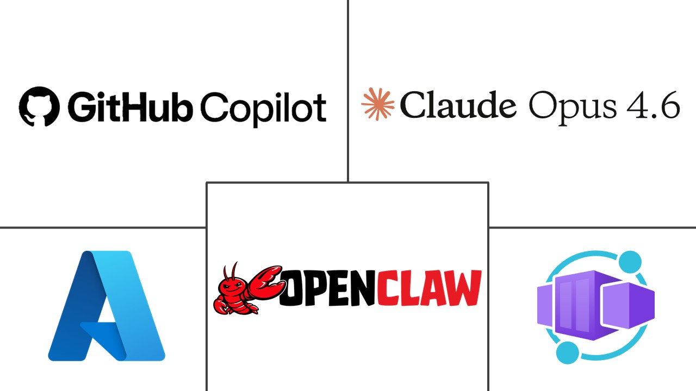
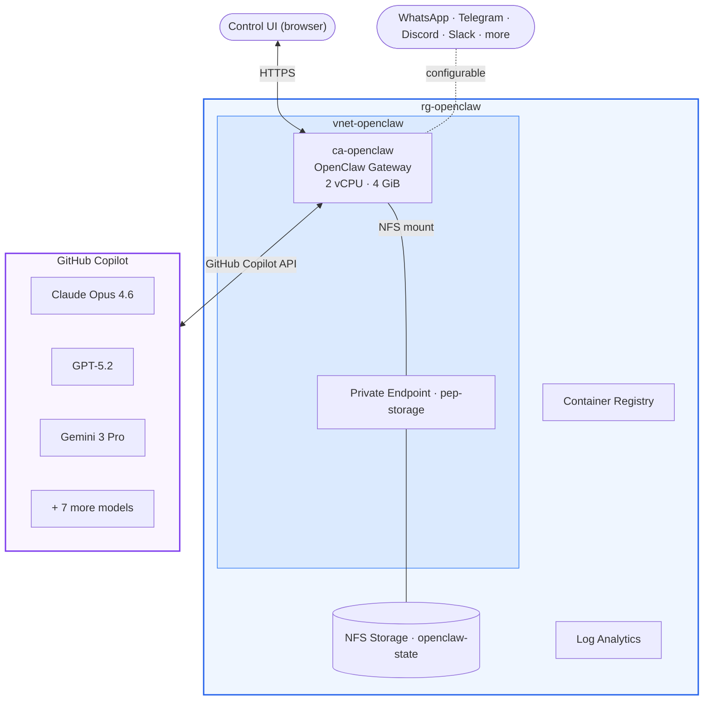

# OpenClaw on Azure Container Apps

<p align="center">
  
</p>

Deploy [OpenClaw](https://github.com/openclaw/openclaw) on Azure Container Apps with GitHub Copilot as the LLM provider.

## What is OpenClaw

[OpenClaw](https://openclaw.ai/) is an open-source, self-hosted personal AI assistant. You run a single Gateway process on your own machine or a server, and it connects your chat apps (WhatsApp, Telegram, Discord, Slack, Signal, iMessage) to AI agents. Built for developers and power users who want a personal assistant they can message from anywhere without giving up control of their data.

[](https://github.com/openclaw/openclaw) · [Docs](https://docs.openclaw.ai/) · [Source](https://github.com/openclaw/openclaw) · [DeepWiki](https://deepwiki.com/openclaw/openclaw)

## What this repo does

This repo provides a Bicep template and a PowerShell script that deploy OpenClaw to Azure Container Apps. GitHub Copilot authenticates via device flow with your existing GitHub account, so there are no API keys to manage. The container image builds remotely in Azure Container Registry, so no Docker Desktop is needed on your machine.

The Bicep template creates the full Azure infrastructure (VNet, NFS storage with private endpoint, container registry, Container Apps environment). The deploy script builds the OpenClaw image from source, configures the gateway, and outputs a ready-to-use Control UI URL.

## Prerequisites

- Azure CLI 2.80+ (`az version`)
- An active Azure subscription (`az account show`)
- Git

Verify resource providers are registered:

```powershell
az provider show --namespace Microsoft.App --query "registrationState" -o tsv
az provider show --namespace Microsoft.ContainerRegistry --query "registrationState" -o tsv
az provider show --namespace Microsoft.Storage --query "registrationState" -o tsv
az provider show --namespace Microsoft.OperationalInsights --query "registrationState" -o tsv
az provider show --namespace Microsoft.ManagedIdentity --query "registrationState" -o tsv
```

If any show `NotRegistered`: `az provider register --namespace <name>`.

## Deploy

```powershell
# 1. Clone this repo
git clone https://github.com/spiroskon/openclaw-azure-containerapps.git
cd openclaw-azure-containerapps

# 2. Deploy infrastructure (~5 min)
az group create --name rg-openclaw --location swedencentral
az deployment group create --resource-group rg-openclaw `
  --template-file bicep/main.bicep --parameters bicep/main.bicepparam

# 3. Build and configure OpenClaw (~10 min)
.\deploy-openclaw.ps1 -ResourceGroup rg-openclaw

# 4. Authenticate GitHub Copilot (interactive, ~2 min)
az containerapp exec --name ca-openclaw --resource-group rg-openclaw
#   node openclaw.mjs models auth login-github-copilot
#   Follow the device flow in your browser, then type: exit
```

Open the Control UI URL printed by the script. Send a test message.

### Verify

```powershell
az containerapp show --name ca-openclaw --resource-group rg-openclaw `
  --query "{fqdn:properties.configuration.ingress.fqdn,revision:properties.latestRevisionName}" -o table

az containerapp logs show --name ca-openclaw --resource-group rg-openclaw --tail 20 --type console
```

You should see a valid FQDN, an active revision, and gateway startup logs without crash loops.

---

## Architecture



This deployment uses `github-copilot/claude-opus-4.6`. GitHub Copilot provides access to models from Anthropic, OpenAI, Google, and xAI through a single subscription. Switch models after deployment with `node openclaw.mjs models set <model>`.

<details>
<summary>All available models (from <code>openclaw models list</code>)</summary>

| Model | Provider |
|-------|----------|
| `github-copilot/claude-opus-4.6` | Anthropic |
| `copilot-proxy/claude-sonnet-4.5` | Anthropic |
| `copilot-proxy/claude-haiku-4.5` | Anthropic |
| `copilot-proxy/gpt-5.2` | OpenAI |
| `copilot-proxy/gpt-5.2-codex` | OpenAI |
| `copilot-proxy/gpt-5.1-codex-max` | OpenAI |
| `copilot-proxy/gpt-5-mini` | OpenAI |
| `copilot-proxy/gemini-3-pro` | Google |
| `copilot-proxy/gemini-3-flash` | Google |
| `copilot-proxy/grok-code-fast-1` | xAI |

</details>

### Resources created by Bicep

| Resource | Type |
|----------|------|
| VNet + 2 subnets | `Microsoft.Network/virtualNetworks` |
| Premium FileStorage + NFS share | `Microsoft.Storage/storageAccounts` |
| Private endpoint + DNS zone | `Microsoft.Network/privateEndpoints` |
| Azure Container Registry | `Microsoft.ContainerRegistry/registries` |
| Log Analytics workspace | `Microsoft.OperationalInsights/workspaces` |
| Container Apps Environment + NFS storage | `Microsoft.App/managedEnvironments` |
| Container App (placeholder) | `Microsoft.App/containerApps` |

Globally unique names (ACR, storage) are auto-generated using `uniqueString()`.

### What the deploy script does

The script (`deploy-openclaw.ps1`) auto-discovers resource names from Bicep deployment outputs, then:

1. Clones OpenClaw source from GitHub (if not already present)
2. Builds the container image remotely via `az acr build` (~6 min)
3. Generates a 256-bit gateway token
4. Updates the Container App with the OpenClaw image, NFS volume mount, and startup command
5. Runs non-interactive onboard and sets the model to `github-copilot/claude-opus-4.6`
6. Outputs the Control UI URL with embedded token

---

## Security

Run the built-in security audit after deployment:

```powershell
az containerapp exec --name ca-openclaw --resource-group rg-openclaw `
  --command "node openclaw.mjs security audit"
```

| Finding | Severity | Context |
|---------|----------|---------|
| `allowInsecureAuth` enabled | CRITICAL | Required for initial setup. Removable through device pairing (below). |
| State dir world-writable (777) | CRITICAL | NFS mount root defaults to 777. Files inside are owned by `node` with correct permissions. |
| No auth rate limiting | WARN | 256-bit token makes brute force infeasible. |

### Device pairing (optional hardening)

Disabling `allowInsecureAuth` switches the Control UI to cryptographic device pairing and removes the critical audit finding.

```powershell
# Get your gateway token
az containerapp exec --name ca-openclaw --resource-group rg-openclaw `
  --command "printenv OPENCLAW_GATEWAY_TOKEN"

# Disable insecure auth
az containerapp exec --name ca-openclaw --resource-group rg-openclaw `
  --command "node openclaw.mjs config set gateway.controlUi.allowInsecureAuth false"

# Restart the container
$rev = az containerapp show --name ca-openclaw --resource-group rg-openclaw `
  --query "properties.latestRevisionName" -o tsv
az containerapp revision restart --revision $rev --resource-group rg-openclaw

# Open/refresh the Control UI in your browser (creates a pending device request)
# Then approve via loopback inside the container:
az containerapp exec --name ca-openclaw --resource-group rg-openclaw `
  --command "node openclaw.mjs devices approve --latest --url ws://127.0.0.1:18789 --token <TOKEN>"
```

If something breaks, re-enable insecure auth:

```powershell
az containerapp exec --name ca-openclaw --resource-group rg-openclaw `
  --command "node openclaw.mjs config set gateway.controlUi.allowInsecureAuth true"
# Restart the revision as above
```

Clearing browser data or switching browsers requires re-pairing.

---

## Design decisions

**Azure Container Apps over ACI or VMs.** Managed HTTPS ingress, automatic TLS, consumption-based pricing, built-in VNet integration.

**NFS over SMB for persistent storage.** NFS authenticates via network rules through the private endpoint, which avoids the `allowSharedKeyAccess: false` restriction enforced by some Azure tenants. SMB would fail silently in those environments.

**Two-phase deployment.** Bicep deploys infrastructure with a placeholder container (Microsoft's ACA quickstart image) to verify networking, storage, and ingress before the deploy script builds the real image and swaps it in.

**GitHub Copilot as LLM provider.** Device-flow OAuth with your existing GitHub account. OpenClaw has a built-in GitHub Copilot provider, so authentication is a one-time browser flow.

---

<details>
<summary><strong>Manual CLI reference</strong> (deploy each resource individually)</summary>

These commands show how each Azure resource was originally configured. Every gotcha is already handled in the Bicep template.

### Step 1: Resource group

```powershell
az group create --name rg-openclaw --location swedencentral
```

### Step 2: Container registry

```powershell
az acr create --name <your-acr-name> --resource-group rg-openclaw `
  --sku Basic --admin-enabled true --location swedencentral
```

ACR names must be globally unique. Check with `az acr check-name --name <name>`.

### Step 3: Build image from source

```powershell
git clone https://github.com/openclaw/openclaw.git openclaw-repo
az acr build --registry <your-acr-name> --image openclaw:latest `
  --file openclaw-repo/Dockerfile openclaw-repo/
```

### Step 4: Networking + NFS storage

NFS is chosen over SMB because some tenants enforce `allowSharedKeyAccess: false`, which blocks ACA's SMB mount. NFS authenticates via network rules (private endpoint).

```powershell
az network vnet create --resource-group rg-openclaw --name vnet-openclaw `
  --location swedencentral --address-prefix 10.1.0.0/26

az network vnet subnet create --resource-group rg-openclaw --vnet-name vnet-openclaw `
  --name snet-aca --address-prefixes 10.1.0.0/27 `
  --delegations Microsoft.App/environments --service-endpoints Microsoft.Storage

az network vnet subnet create --resource-group rg-openclaw --vnet-name vnet-openclaw `
  --name snet-pe --address-prefixes 10.1.0.32/28

az storage account create --name <your-storage-name> --resource-group rg-openclaw `
  --location swedencentral --sku Premium_LRS --kind FileStorage `
  --enable-large-file-share --https-only false

az storage share-rm create --storage-account <your-storage-name> `
  --resource-group rg-openclaw --name openclaw-state --quota 100 --enabled-protocols NFS

$storageId = (az storage account show --name <your-storage-name> `
  --resource-group rg-openclaw --query "id" -o tsv)

az network private-endpoint create --resource-group rg-openclaw --name pep-storage `
  --vnet-name vnet-openclaw --subnet snet-pe `
  --private-connection-resource-id $storageId --group-id file `
  --connection-name connection-storage --location swedencentral

az network private-dns zone create --resource-group rg-openclaw `
  --name "privatelink.file.core.windows.net"

az network private-dns link vnet create --resource-group rg-openclaw `
  --zone-name "privatelink.file.core.windows.net" --name link-vnet `
  --virtual-network vnet-openclaw --registration-enabled false

az network private-endpoint dns-zone-group create --resource-group rg-openclaw `
  --endpoint-name pep-storage --name dnsgroup-storage `
  --private-dns-zone "privatelink.file.core.windows.net" --zone-name file
```

### Step 5: Log Analytics

```powershell
az monitor log-analytics workspace create --resource-group rg-openclaw `
  --workspace-name law-openclaw --location swedencentral
```

### Step 6: Container Apps Environment + NFS storage

```powershell
$SUBNET_ID = (az network vnet subnet show --resource-group rg-openclaw `
  --vnet-name vnet-openclaw --name snet-aca --query "id" -o tsv)
$LAW_ID = (az monitor log-analytics workspace show --resource-group rg-openclaw `
  --workspace-name law-openclaw --query "customerId" -o tsv)
$LAW_KEY = (az monitor log-analytics workspace get-shared-keys --resource-group rg-openclaw `
  --workspace-name law-openclaw --query "primarySharedKey" -o tsv)

az containerapp env create --name cae-openclaw --resource-group rg-openclaw `
  --location swedencentral --infrastructure-subnet-resource-id $SUBNET_ID `
  --logs-workspace-id $LAW_ID --logs-workspace-key $LAW_KEY

az extension add -n containerapp --upgrade
$STORAGE_KEY = (az storage account keys list --account-name <your-storage-name> `
  --resource-group rg-openclaw --query "[0].value" -o tsv)

az containerapp env storage set --name cae-openclaw --resource-group rg-openclaw `
  --storage-name openclawstorage --storage-type NfsAzureFile `
  --server <your-storage-name>.file.core.windows.net `
  --azure-file-share-name /<your-storage-name>/openclaw-state `
  --azure-file-account-name <your-storage-name> --azure-file-account-key $STORAGE_KEY `
  --access-mode ReadWrite
```

### Step 7: Container App

```powershell
$bytes = New-Object byte[] 32
[System.Security.Cryptography.RandomNumberGenerator]::Fill($bytes)
$GATEWAY_TOKEN = [BitConverter]::ToString($bytes).Replace('-','').ToLower()

$ACR_USERNAME = (az acr credential show --name <your-acr-name> --query "username" -o tsv)
$ACR_PASSWORD = (az acr credential show --name <your-acr-name> --query "passwords[0].value" -o tsv)

az containerapp create --name ca-openclaw --resource-group rg-openclaw `
  --environment cae-openclaw --image <your-acr-name>.azurecr.io/openclaw:latest `
  --registry-server <your-acr-name>.azurecr.io `
  --registry-username $ACR_USERNAME --registry-password $ACR_PASSWORD `
  --target-port 18789 --ingress external --min-replicas 1 --max-replicas 1 `
  --cpu 2.0 --memory 4Gi `
  --env-vars "OPENCLAW_GATEWAY_TOKEN=$GATEWAY_TOKEN" "NODE_ENV=production" "HOME=/home/node" "TERM=xterm-256color"
```

Then add NFS volume mount via YAML update (see deploy script for the exact structure).

### Step 8: Configure OpenClaw

```powershell
az containerapp exec --name ca-openclaw --resource-group rg-openclaw
```

Inside the container:

```sh
node openclaw.mjs onboard --non-interactive --accept-risk --mode local --flow manual \
  --auth-choice skip --gateway-port 18789 --gateway-bind lan --gateway-auth token \
  --gateway-token $OPENCLAW_GATEWAY_TOKEN --skip-channels --skip-skills --skip-daemon --skip-health
node openclaw.mjs models set github-copilot/claude-opus-4.6
node openclaw.mjs config set gateway.controlUi.allowInsecureAuth true
node openclaw.mjs models auth login-github-copilot
exit
```

</details>

---

## Known issues

### "Conversation info (untrusted metadata)" in chat

OpenClaw 2026.2.17+ displays a metadata block in the Control UI for every user message:

```
Conversation info (untrusted metadata):
{"message_id": "...", "sender": "openclaw-control-ui"}
[timestamp] your message
```

This is an upstream UI bug, not a deployment issue. The gateway injects `message_id` metadata for LLM context, and the Control UI renders it verbatim instead of stripping it. "Untrusted" refers to the gateway's internal security model (client-supplied metadata is never trusted).

Tracked in [#13989](https://github.com/openclaw/openclaw/issues/13989) and [#20297](https://github.com/openclaw/openclaw/issues/20297). Fix PRs [#14045](https://github.com/openclaw/openclaw/pull/14045) and [#15998](https://github.com/openclaw/openclaw/pull/15998) are pending merge.

**Workaround:** Pin to `v2026.2.15` when building the image.

---

## Cleanup

```powershell
az group delete --name rg-openclaw --yes --no-wait
```

## Tested with

| Component | Version |
|-----------|---------|
| OpenClaw | Latest from `main` branch (Feb 2026) |
| Azure CLI | 2.80+ |
| Bicep | Built-in with Azure CLI |
| Region | Sweden Central |
| LLM | `github-copilot/claude-opus-4.6` |

## Related

- [OpenClaw Secure Docker Setup](https://github.com/spiroskon/openclaw-secure-docker) for running locally on Windows
- [OpenClaw Docs](https://docs.openclaw.ai/)
- [OpenClaw GitHub](https://github.com/openclaw/openclaw)

## License

MIT
